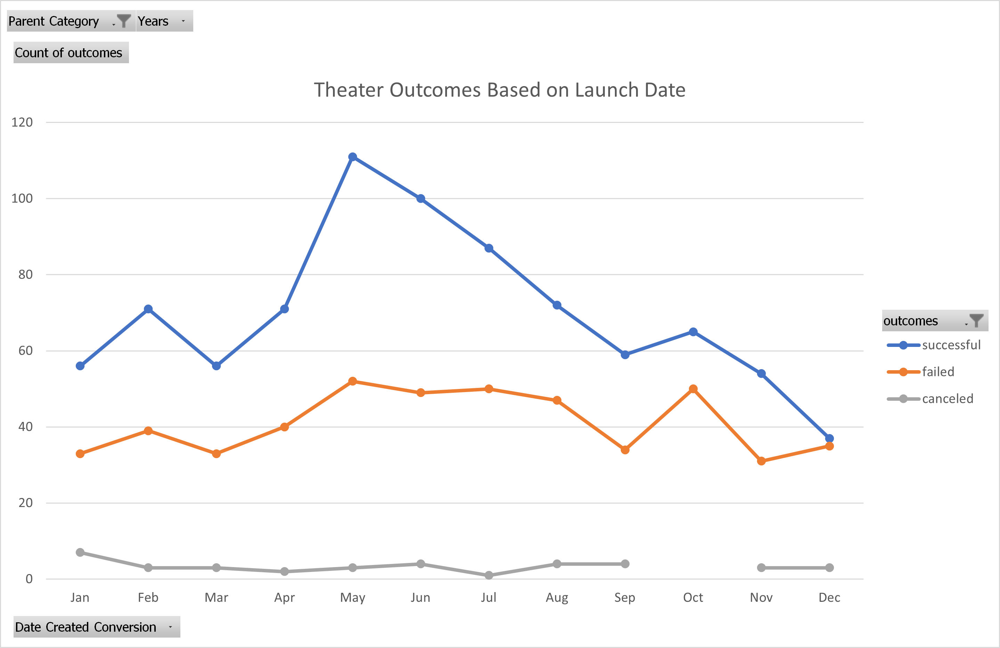
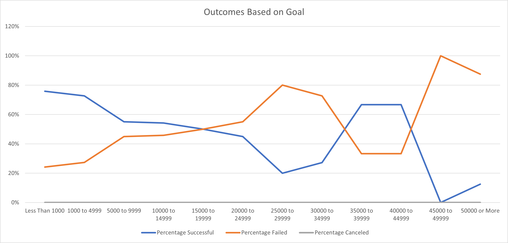

# Kickstarting with Excel

## Overview of Project

The purpose of this analysis is to help Louise determine the outcomes of Kickstarter campaigns based on their launch dates and funding goals. This is accomplished through the use of pivot tables and line charts.

## Analysis and Challenges

### Analysis of Outcomes Based on Launch Date

The first analysis looked at how many successful or failed Kickstarter campaigns launched each month, and whether there was a relationship between time of the year and a campaign's success. First, a pivot table was created from the "Kickstarter" sheet that featured the data in the "Goal", "Outcomes", "Subcategory", and "Date Created Conversion" columns. This pivot table was then filtered so that the "Parent Category" only showed "theater" and the campaign outcomes were filtered so that "successful" was shown first. A line chart was created with the months as the X axis and the number of projects with each outcome as the Y axis. Each line shows each separate outcome.

### Analysis of Outcomes Based on Goals

This analysis was more detailed and required more filtering of the data. I wanted to look at the percentage of campaigns that were successful at differently sized funding goals. To start, I created a new sheet called "Outcomes Based On Goals" and created multiple categories in the "Goal" column with $5000 ranges. The two categories at the lower and upper ends had goals of less than $1000 and more than $50000, because it was assumed that these categories might have outliers. To gather and separate the specific data I needed, I created three new columns, each showing the number of successful, failed, and canceled campaigns. To count the number of campaigns with each outcome, I used the COUNTIFS() function. For each funding goal range, the criteria were an Outcome of "successful", a Subcategory of "plays", and a Goal falling within the corresponding range. A "Total Projects" column was created that used the SUM() function to count the total number of projects in each category, and then the number of projects with each outcome was divided by the total number of projects and converted into percentages, which populated columns F through H. A line chart was created showing the categories of funding goals on the X axis and the percentage of projects on the Y axis. Each colored line represents each outcome.   

### Challenges and Difficulties Encountered

One challenge I encountered was creating rows in "Outcomes by Launch Date" pivot table for each month. As there is no separate column for months in the Kickstarter sheet, I had to use the data in the Date Created Conversion column and then move that field into the "Rows" column in the PivotTable Fields section. To ensure that this data was being filtered by month, I had to uncheck the "Years" and "Quarters" fields.
For the "Outcomes Based On Goals" analysis, I had trouble applying the COUNTIFS() formula to every goal category and every outcome, because it involved a lot of copy-pasting different sections of the formula and revising it to account for new data ranges or correct typos. At first I tried copy-pasting the formula into each new column, but this didn't work because Excel was automatically changing the data ranges for the criteria. Another challenge I encountered with this was that a few times I accidentally used the wrong criteria, for example using the "Pledged" data instead of the "Goal" data.

## Results

- What are two conclusions you can draw about the Outcomes based on Launch Date?

From a quick glance at the chart it can be determined that the most campaigns that reached their funding goals were launched from May to July. What this indicates is that plays are more likely to be shown in the summer, and/or audiences are more likely to go out to see plays. Meanwhile, it appears that the launch date had little effect on the campaigns that failed, as there were between 31 and 50 failed campaigns per month with no clear peaks. Some other factor probably had an influence.

- What can you conclude about the Outcomes based on Goals?

From less than $1000 to $24999, it seems that there is a slight downward trend in the success rate of campaigns as the funding goal increases. However, there is a sharp decline in the success percentage from $25000 to $29999, and then a sharp increase from $35000 to $44999, finally dropping to very low percents from $45000 upwards. Why there is an increase in success from $35000 to $44999 is hard to determine from the graph alone, but looking at the chart it can be seen that within this range there were very few campaigns launched overall, compared to the hundreds of campaigns with lower funding goals. This smaller sample size leads to much greater outliers in the success percentage.

- What are some limitations of this dataset?

As mentioned above, just looking at the graphs doesn't tell you the full story. Analyzing the number of successful campaigns based on launch date doesn't tell us other important contributing factors like how high the funding goals were or how large the average donations were. It could also be easy to see the pattern in the Outcomes Based on Goal graph as completely random without noting the amount of campaigns in each goal range. 

- What are some other possible tables and/or graphs that we could create?

Based on the limitations of this data and what we found from this analysis, we could create more tables that show how other factors affecting the success rate relate to each other. For example, we could look at the average number of backers for projects launched in each month to see whether it is true that people are more likely to see plays during the summer. We could also look at the percentages of successful projects per month instead of just the total number of successful, failed, or canceled projects. To combine the data for both analyses, we could look at the average goal amount per month to see if larger and more ambitious plays are attempted to be funded during the summer.